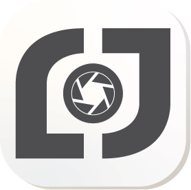

 

  
<h1 style="font-family: Georgia, serif; font-weight: 400; font-size: 2.2em; margin: 0; letter-spacing: -0.02em; color: #1c1917;">Jan Levínský</h1>

Cinematography &amp; Photography

 
<a href="https://levinskyj.art" style="text-decoration: none; color: #2c3e50; font-weight: 500;">🌐 levinskyj.art</a>
·
<a href="https://www.instagram.com/levinskyj.cine/" style="text-decoration: none; color: #2c3e50; font-weight: 500;">📷 @levinskyj.cine</a>
·
<a href="https://www.youtube.com/@LevinskyJ" style="text-decoration: none; color: #2c3e50; font-weight: 500;">▶ @LevinskyJ</a>
  

 
<pre style="font-family: monospace; font-size: 0.85em; color: #7a7570; line-height: 1.6;">
⚬⚬⚬⚬  každý snímek nese perforaci     ⚬⚬⚬⚬
⚬⚬⚬⚬  každý přechod je jako střih     ⚬⚬⚬⚬
⚬⚬⚬⚬  každý projekt je políčko filmu  ⚬⚬⚬⚬
</pre>
 

## 🎞️ Co to je

Osobní portfolio, které zachází s webem jako s filmovým pásem. Každý obrázek nese **35mm perforace**, rozložení dýchá v **bento gridu** a přechody působí jako střihy mezi scénami.

Čistě vanilkový <code style="background: #f0ece6; padding: 1px 5px; border-radius: 4px; color: #2c3e50;">HTML</code>, <code style="background: #f0ece6; padding: 1px 5px; border-radius: 4px; color: #2c3e50;">CSS</code> a <code style="background: #f0ece6; padding: 1px 5px; border-radius: 4px; color: #2c3e50;">JavaScript</code>. Bez frameworků, bez build stepu. Jen prohlížeč, DOM a hodně pozornosti k detailu.

---

## ✨ Co umí

### 🎬 Filmové perforace
Každý video i foto snímek je orámovaný procedurálně generovanými 35mm okýnky. Perforace se škálují podle poměru stran a vykreslují se jako průhledná vrstva — není to border, je to filmová logika.

### 🍱 Bento Grid galerie
Projekty plují v responzivní mřížce s reálnými poměry stran. Žádné forced cropování, žádné přednastavené rámečky. Drag & drop pro změnu pořadí.

### ✨ Plynulé animace
- **Přeskupení gridu** při filtrování — kartičky necvakají, cestují na nové pozice
- **Scroll-triggerované odkrytí** — působí kinematograficky, ne korporátně
- **Mikro-interakce** na každém hoveru, kliku, změně stavu
- Plná podpora <code style="background: #f0ece6; padding: 1px 5px; border-radius: 4px; color: #2c3e50;">prefers-reduced-motion</code>

### 📱 Responzivní design
Od mobilu po ultra-wide. Hamburger menu na mobilu, sidebar na desktopu. Všechny breakpointy dolaďené ručně. Automatický překlad do EN pro návštěvníky mimo ČR.

### 🎨 Vizuální styl
Tmavě modrý akcent (<code style="background: #f0ece6; padding: 1px 5px; border-radius: 4px; color: #2c3e50;">#2c3e50</code>) na teplém krémovém pozadí (<code style="background: #f0ece6; padding: 1px 5px; border-radius: 4px; color: #2c3e50;">#faf8f5</code>). Žádná čistá bílá, žádná ostrá čerň. Písmo kombinuje Bricolage Grotesque s Interem.

---

## 🧱 Struktura projektu

<pre style="background: #f7f4ef; border: 1px solid #e2ddd6; border-radius: 8px; padding: 16px; font-size: 0.85em; line-height: 1.7; overflow-x: auto;">
├── index.html         # Hlavní portfolio stránka
├── about.html         # Životopis / O mně
├── project.html       # Detail projektu (dynamický)
├── card.html          # Digitální vizitka
├── style.css          # Sdílené styly
├── main.js            # Sdílené JS (i18n, perforace, animace)
├── projects.json      # Data všech projektů
├── builder.py         # Lokální editor projektů
└── media/             # Fotky, videa, logo
</pre>

---

## 🛠️ Vývoj

<pre style="background: #f7f4ef; border: 1px solid #e2ddd6; border-radius: 8px; padding: 16px; font-size: 0.85em; line-height: 1.5; overflow-x: auto;">
# Editor projektů
python builder.py

# Otevře http://localhost:8765
# Stránka je čistě statická — stačí otevřít v prohlížeči
</pre>

---

© Jan Levínský · všechna práva vyhrazena

 

